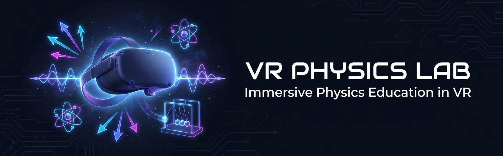

<!-- Banner -->
<div align="center">
  

  <h1>🔬 VR Physics Lab</h1>
  <p><strong>Immersive VR Physics Education for Schools & Universities</strong></p>

  [](LICENSE)
  [](https://unity.com)
  [](https://www.meta.com/quest/)
  [](https://www.khronos.org/openxr/)
  [](https://github.com/vr-physics-lab/vr-physics-lab)
  [](CONTRIBUTING.md)

  <br/>

  [**📖 Documentation**](docs/) · [**🚀 Releases**](https://github.com/vr-physics-lab/vr-physics-lab/releases) · [**🐛 Report Bug**](https://github.com/vr-physics-lab/vr-physics-lab/issues/new?template=bug_report.md) · [**💡 Request Feature**](https://github.com/vr-physics-lab/vr-physics-lab/issues/new?template=feature_request.md)

</div>

---

## 🌍 Overview

**VR Physics Lab** is an open-source educational virtual reality platform that transforms how students learn physics. Instead of reading about Newton's Laws or watching simulations, students *experience* physics firsthand — in immersive, interactive VR experiments on Meta Quest 3.

The project is a **government-funded initiative** awarded through the official *"Bo'lajak olim" (Future Scientist)* innovation grant competition in Uzbekistan, and is designed to serve schools and universities across Central Asia and beyond.

> 🏆 **Grant Winner** — "Bo'lajak olim" Innovation Competition, Uzbekistan  
> 💰 Grant Amount: 72,666,000 UZS (~$5,650 USD)  
> 📌 Status: Implementation Stage

---

## ✨ Features

| Module | Description | Status |
|--------|-------------|--------|
| 🍎 **Newton's Laws** | Interactive force, mass, and acceleration experiments | 🔄 In Progress |
| 🌍 **Gravity & Free Fall** | Drop objects in different gravitational fields | 📅 Planned |
| ⚡ **Energy Conservation** | Visualize kinetic and potential energy transfer | 📅 Planned |
| 💥 **Collisions** | Elastic and inelastic collision sandbox | 📅 Planned |
| 🚀 **Velocity & Acceleration** | Motion graphs come to life in VR | 📅 Planned |
| 📊 **Real-time Data Dashboard** | In-VR graphs and measurement tools | 📅 Planned |

---

## 🎯 Physics Topics Covered

- ⚖️ Newton's First, Second, and Third Laws
- 🌍 Gravity and Gravitational Fields
- 💪 Force and Mass relationships
- 🏃 Velocity and Acceleration
- ⚡ Conservation of Energy
- 💥 Elastic and Inelastic Collisions

---

## 🛠️ Tech Stack

| Technology | Purpose |
|------------|---------|
| **Unity 2022.3 LTS** | Core VR development engine |
| **C#** | Game logic and physics simulation |
| **Meta Quest 3** | Target VR hardware platform |
| **Meta XR SDK** | Meta platform integration |
| **OpenXR** | Cross-platform XR standard |
| **XR Interaction Toolkit** | VR interactions and locomotion |
| **Blender** | 3D asset creation |
| **GitHub Actions** | CI/CD pipeline |

---

## 🚀 Getting Started

### Prerequisites

- Unity 2022.3 LTS or newer
- Meta Quest 3 device (or Meta Quest Link for PC testing)
- Meta XR SDK (installed via Unity Package Manager)
- Android Build Support module for Unity
- Git LFS (for large assets)

### Installation

```bash
# 1. Clone the repository
git clone https://github.com/vr-physics-lab/vr-physics-lab.git
cd vr-physics-lab

# 2. Pull LFS assets
git lfs pull

# 3. Open in Unity Hub
# File → Open Project → select cloned folder

# 4. Install dependencies via Unity Package Manager
# Window → Package Manager → install Meta XR SDK, XR Interaction Toolkit
```

### Build & Deploy to Meta Quest 3

```bash
# Enable Developer Mode on your Quest 3
# Connect via USB and enable ADB
adb devices

# In Unity: File → Build Settings → Android → Build and Run
```

For detailed setup instructions, see [docs/setup.md](docs/setup.md).

---

## 🗺️ Roadmap

See our full [ROADMAP.md](ROADMAP.md) for detailed milestones.

- [x] Project inception & grant application
- [x] Grant award (Bo'lajak olim competition)
- [ ] **v0.1** — Core engine setup, Newton's Laws experiment
- [ ] **v0.2** — Gravity & Free Fall experiment
- [ ] **v0.3** — Energy Conservation module
- [ ] **v0.4** — Collisions sandbox
- [ ] **v1.0** — Full prototype for school deployment
- [ ] **v2.0** — Multi-subject STEM platform (Chemistry, Engineering)

---

## 🤝 Contributing

We welcome contributions from educators, VR developers, Unity engineers, and physics enthusiasts!

Please read [CONTRIBUTING.md](CONTRIBUTING.md) to get started.

**Ways to contribute:**
- 🐛 Report bugs via [Issues](https://github.com/vr-physics-lab/vr-physics-lab/issues)
- 💡 Suggest new physics experiments
- 🎨 Create 3D assets in Blender
- 🧑‍💻 Implement new features
- 📖 Improve documentation
- 🌍 Translate UI to other languages

---

## 📄 License

This project is licensed under the **MIT License** — see [LICENSE](LICENSE) for details.

Funded in part by a government innovation grant from the Republic of Uzbekistan.

---

## 🏫 About

VR Physics Lab is developed by a team based in Uzbekistan, with the mission to make quality STEM education accessible to every student through the power of virtual reality.

> *"The best way to learn physics is to experience it."*

---

<div align="center">
  <sub>Built with ❤️ for students everywhere · Funded by the Republic of Uzbekistan</sub>
</div>
